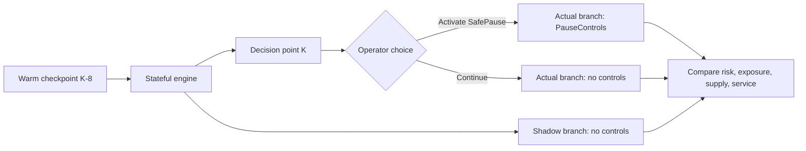
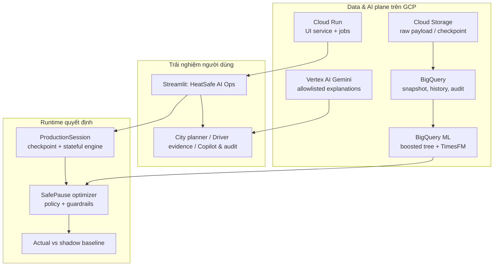
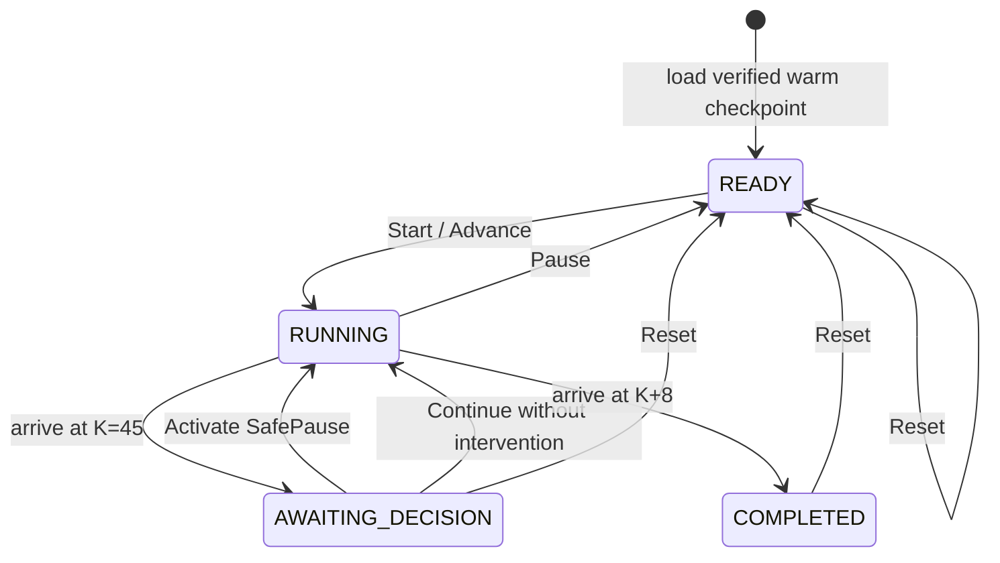
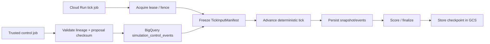

# HeatSafe AI Ops — Diễn giải đầy đủ app hiện tại

> **Phạm vi tài liệu:** mô tả theo mã nguồn hiện tại, được rà soát ngày **26/07/2026**. Tài liệu cố ý tách bạch: (1) luồng UI Streamlit đang chạy, (2) hạ tầng/data/AI GCP có trong dự án, và (3) durable simulation runtime đã được xây dựng nhưng chưa phải đường nóng mặc định của UI.
>
> **Tuyên bố an toàn:** HeatSafe là công cụ hỗ trợ quyết định vận hành trong demo mô phỏng. Heat Index chỉ là chỉ báo sàng lọc; rủi ro/hiệu quả can thiệp không phải chẩn đoán y khoa hay bằng chứng giảm sự cố sức khỏe. App không gửi dispatch, notification, hydration order hay lệnh vận hành thật đến tài xế.

---

## 1. Tóm tắt điều hành

**HeatSafe AI Ops** là ứng dụng Streamlit hỗ trợ đội vận hành ride-hailing hai bánh tại Hà Nội ra quyết định nghỉ chủ động (**SafePause**) khi nắng nóng cực đoan.

App không tối ưu theo một điểm rủi ro đơn lẻ. Nó kết hợp:

- trạng thái nhiệt và vận hành theo từng quận;
- đặc trưng từng tài xế như thời gian phơi nhiễm liên tục, heat dose, quãng đường, nghỉ ngơi và hydration gap;
- dự báo nhu cầu;
- nhiều lựa chọn SafePause theo thời điểm/thời lượng;
- các ràng buộc bắt buộc về an toàn, chi phí, fulfillment và ETA;
- bằng chứng, audit và counterfactual baseline.

Điểm cải tiến lớn nhất so với bản chỉ có snapshot tĩnh là app hiện đã có **stateful Production window**: state của driver, order, pause, exposure và service thay đổi theo thời gian; người dùng chọn can thiệp hoặc không can thiệp tại điểm quyết định; sau đó có thể quan sát nhánh có can thiệp (**actual**) so với nhánh không can thiệp (**shadow baseline**).



---

## 2. Bài toán sản phẩm

Trong nắng nóng cực đoan, việc yêu cầu tài xế nghỉ đồng loạt có thể giảm rủi ro phơi nhiễm nhưng lại gây thiếu nguồn cung, backlog, giảm fulfillment và tăng ETA. Ngược lại, chỉ theo đuổi throughput có thể làm nhóm phơi nhiễm dài bị bỏ qua.

HeatSafe xử lý trade-off này theo nguyên tắc:

1. **Safety-first:** tài xế phơi nhiễm liên tục từ **240 phút (4 giờ)** là cohort bắt buộc trong policy demo.
2. **Action-aware:** so sánh rủi ro khi không hành động với rủi ro của từng phương án pause, thay vì xếp hạng bằng một risk score tĩnh.
3. **Constraint-first:** chỉ đề xuất nếu đồng thời thỏa coverage bắt buộc, budget cap, fulfillment guardrail và ETA guardrail.
4. **Fail closed:** nếu evidence thiếu, prediction sai lineage hoặc không có phương án feasible, app chỉ hiển thị monitoring — không bịa ra recommendation.
5. **Explainable & auditable:** proposal giữ lineage, model/prediction metadata, factors, wave plan, stress outcome và checksum/ID.

---

## 3. Các thuật ngữ cần biết

| Thuật ngữ | Ý nghĩa trong HeatSafe |
|---|---|
| **SafePause** | Kế hoạch nghỉ có phân wave, thời lượng và delay xác định cho một nhóm tài xế. Đây là mô phỏng; không dispatch thật. |
| **Snapshot** | Ảnh chụp evidence của một thời điểm: zone state, weather, driver features, predictions và forecast. |
| **Tick** | Một lần advance mô phỏng, đại diện cho **15 phút vận hành**. Một ngày mô phỏng có 96 tick. |
| **K** | Tick quyết định trong Production window. Artifact hiện tại chọn **K=45**. |
| **Warm checkpoint** | State đã xác thực tại K−8, dùng để khởi động nhanh, reset deterministic và tránh replay từ đầu ngày. |
| **Actual branch** | Nhánh mô phỏng sau khi operator chọn `ACTIVATE` hoặc `CONTINUE`. Đây không phải real-world actual outcome. |
| **Shadow baseline** | Nhánh counterfactual luôn không có PauseControl, dùng làm baseline đối chiếu. |
| **Current/Production** | Chế độ đứng tại checkpoint K=45 đã kiểm chứng, hiển thị evidence và đề xuất tại một thời điểm quyết định cố định. |
| **Simulation playback** | Chế độ trình bày K−8 → K+8 cho giám khảo. Timeline đã được tính trước từ stateful engine; Play/Next/area selection chạy trong browser, không rerun Streamlit hay chạy lại optimizer. |
| **Durable runtime** | Đường simulation dùng BigQuery/GCS/lease/checkpoint/control writer. Có trong code/hạ tầng, nhưng Simulation playback không gọi trực tiếp đường này. |

---

## 4. Kiến trúc tổng thể

### 4.1 Ba lớp của hệ thống



### 4.2 Điểm cần phân biệt: kiến trúc có sẵn và hot path UI hiện tại

Dự án có đầy đủ thành phần Cloud Storage, BigQuery, BigQuery ML, Gemini, Cloud Run service/jobs và durable simulation repository. Tuy nhiên, theo `app.py` hiện tại:

- UI cố định scenario là `hanoi_heatwave_v1`.
- **PRODUCTION** tải `ProductionSession`, advance từ checkpoint K−8 đến **K=45** một lần theo `@st.cache_resource`, sau đó hiển thị decision evidence tại K.
- **SIMULATION PLAYBACK** đọc artifact timeline đã tạo từ cùng Production window và
  chuyển frame hoàn toàn trong Custom Component v2 ở browser.
- Vì vậy, luồng UI chính đang dựa trên **verified local Production-window artifact** và local deterministic evidence, không truy vấn BigQuery/BigQuery ML cho mỗi lần render.
- Các hàm/repository cloud như `HybridRepository`, `BigQueryRepository`, `load_snapshot`, `load_selected_decision` và `load_predictive_city_plan` vẫn tồn tại để phục vụ kiến trúc cloud-backed, nhưng không phải nguồn evidence chính của `app.py` ở trạng thái hiện tại.

Đây là lựa chọn có chủ đích cho demo đáng tin cậy: tránh trình diễn “live” nhưng thực tế có nguy cơ phụ thuộc provider I/O, latency hoặc dữ liệu không đồng nhất.

---

## 5. Hai experience mode trong UI

### 5.1 `PRODUCTION`: điểm quyết định cố định, đã kiểm chứng

Mode mặc định không phải snapshot JSON tĩnh cũ. Nó là một decision point K=45 được tạo bằng cách:

1. đọc `manifest.json` và `start_state.json.gz` của Production window;
2. kiểm tra scenario version, generator version, seed, checkpoint format, payload SHA-256, logical state checksum, compressed size và minute identity;
3. advance deterministic từ K−8 đến K=45;
4. dựng zone snapshot, forecast, driver action-risk và city plan đúng tại K;
5. hiển thị proposal city-wide và selected-zone evidence.

Artifact hiện tại được tạo bởi `scripts/build_production_window.py` với:

- seed `42`;
- start tick `37` (K−8);
- decision tick `45`;
- end tick `53` (K+8);
- các zone dùng để review cửa sổ: Hai Bà Trưng, Cầu Giấy, Hà Đông.

> Danh sách zone trong manifest được dùng để tìm/review cửa sổ. Portfolio SafePause thực thi tại K được tính lại từ evidence city-wide hiện tại, không bị giới hạn vĩnh viễn ở ba zone này.

Khi user chọn `Activate SafePause` trong mode này, app chỉ ghi **simulated audit/projected outcome** qua `HybridInterventionAuditStore`; không tạo control cho stateful engine đang tiến tiếp, không gửi lệnh thật.

### 5.2 `SIMULATION PLAYBACK`: presentation replay chạy trong browser

Mode này trình bày cùng hành trình K−8 → K → K+8 nhưng không đặt simulation compute
trên đường nóng của UI. Script
`scripts/build_operator_presentation_timeline.py` chạy deterministic engine và optimizer
trước, rồi ghi một artifact JSON có giới hạn:

- 9 frame từ 09:15 đến điểm quyết định 11:15;
- 8 frame hậu quyết định cho `With SafePause`;
- 8 frame hậu quyết định cho `Without SafePause`;
- đúng 10 khu vực, một bộ decision views dùng chung và không lặp trong từng frame.

Artifact dùng bộ giới hạn presentation cố định `$500` và `$0.32` support/driver. Kết quả
authoritative tại decision frame là `READY`, cover `275 / 275` urgent drivers và còn
`$99` budget reserve, vì vậy giám khảo có thể xem cả hai nhánh. Các giới hạn này không
ghi đè control editable hay quyết định trong Current plan.

Khi người xem bấm Play hoặc Next 15 min, Custom Component v2 giữ nguyên một DOM và chỉ
cập nhật text, SVG bubble map, KPI, cursor và clip của line/area chart. Không có
`st.rerun()`, không tạo `ProductionSession`, không gọi `advance_tick()` và không chạy lại
city optimizer. Đây là display-only replay; mode Current plan vẫn giữ decision/backend
authoritative.

Các điều khiển UI:

| Điều khiển | Hành vi |
|---|---|
| **Play / Pause** | Chạy hoặc dừng presentation timer ngay trong browser. |
| **Next 15 min** | Đổi đúng một frame 15 phút, không gửi event về Python. |
| **Reset** | Đưa presentation cursor về 09:15 ngay trong browser. |
| **Playback speed** | Slow/Normal/Fast chỉ thay cadence của browser timer. |
| **Activate SafePause** | Chọn nhánh hiển thị `With SafePause`; bị disable nếu plan không qua tất cả giới hạn. |
| **Continue monitoring** | Chọn nhánh hiển thị `Without SafePause`. |

Caption của UI nêu rõ: **Synthetic Hanoi operations · display-only replay · no real dispatch**.

### 5.3 Vòng đời state của `ProductionSession` phía runtime

Contract dưới đây vẫn là nguồn tạo timeline và đường kiểm chứng backend. Nó không chạy
lại khi người xem bấm Play/Next trong Simulation playback.

`ProductionSession` giữ trong RAM/session Streamlit:

- `actual_state`, `actual_result`, `actual_history`;
- `shadow_state`, `shadow_result`, `shadow_history`;
- `choice`, `controls`, `decision_evidence`;
- `status`: `READY`, `RUNNING`, `AWAITING_DECISION`, `COMPLETED`.

Luồng chi tiết:



**Invariant actual/shadow:** trước K, hai branch phải giống hệt nhau. Nếu chúng diverge trước control, code ném lỗi. Sau `ACTIVATE`, actual nhận controls còn shadow luôn không nhận controls. Sau `CONTINUE`, actual tiếp tục bằng no-control nên phải vẫn giống shadow.

---

## 6. Stateful simulation engine vận hành như thế nào

### 6.1 State được giữ liên tục

Không giống snapshot tĩnh, engine giữ identity và state qua thời gian cho:

- driver: trạng thái online/trip/pause, shift, exposure, heat dose, rest, hydration gap, earnings, contribution;
- order: requested/accepted/pickup/completed/cancelled, route và service metrics;
- intervention: group/wave SafePause và lifecycle;
- weather, zone-level demand/supply và operational statistics;
- event logs, shock/state phụ trợ.

Mỗi tick gọi 15 lần `advance_minute()`. Theo thứ tự, engine xử lý completion/transition, control đến hạn, intervention hết hạn, shift boundary, generate/match/expire order, rồi cập nhật heat-exposure-economics.

### 6.2 PauseControl và lifecycle

Một `PauseControl` mang:

- `control_id`, `control_event_id`, `proposal_id`;
- danh sách driver hash;
- source tick/snapshot/proposal lineage;
- delay và duration;
- baseline risk và action risk theo driver.

Chính sách pause P0 chỉ cho phép:

- start delay: `0`, `15`, `30`, `45` phút;
- pause duration: `15` hoặc `30` phút.

Khi control được áp trong simulation, driver/intervention đi qua lifecycle như:

```text
ASSIGNED → TO_COOLSTOP → PAUSED → COMPLETED
```

Có thể có trạng thái cancel/recovery tùy transition/điều kiện engine. Đây là state mô phỏng, không phải xác nhận tài xế đã thực sự tới CoolStop.

### 6.3 Actual vs shadow là gì

| Nhánh | Input control | Mục đích |
|---|---|---|
| **Actual** | Có `PauseControl` nếu user chọn Activate; rỗng nếu Continue | Mô phỏng kết quả của lựa chọn hiện tại. |
| **Shadow** | Luôn rỗng | Mô phỏng cùng scenario/seed nhưng không intervention. |

So sánh hai nhánh giúp demo trả lời câu hỏi vận hành quan trọng: nếu chọn SafePause bây giờ, exposure/risk/service thay đổi thế nào so với việc tiếp tục không can thiệp?

### 6.4 Reset và reproducibility

Reset không sinh ngẫu nhiên một snapshot mới. Nó decode cùng warm checkpoint, xác minh hash/checksum, sau đó rebuild state deterministic. Điều này cho phép:

- demo lặp lại cùng bối cảnh;
- test được nhánh Activate và Continue công bằng;
- tránh mất thời gian replay từ midnight khi browser mở app;
- chứng minh outcome đến từ recorded controls, không đến từ dữ liệu đổi ngầm.

---

## 7. Decision engine SafePause

### 7.1 Input cần có

Một recommendation hợp lệ cần evidence cùng snapshot/lineage:

- zone heat index, humidity, active drivers, exposed cohort;
- driver features;
- baseline risk và action-conditioned predictions;
- forecast demand theo các interval 15 phút, gồm median và upper bound;
- constraints: budget cap, partner credit, planning horizon.

Nếu feature/prediction/forecast không match cùng snapshot, app phải fail closed.

### 7.2 Action-conditioned scoring

Thay vì chỉ hỏi “ai có rủi ro cao?”, engine so sánh:

```text
No action
vs.
SafePause(delay ∈ {0, 15, 30, 45}, duration ∈ {15, 30})
```

Tức tối đa tám action variants cho một tài xế. Mỗi action đánh đổi việc giảm risk với chi phí chờ và tác động supply.

Trong Production window local, local evidence builder dùng forecast/risk deterministic theo state engine tại tick hiện tại. Để giảm payload/compute, các tài xế ở xa cả ngưỡng model và ngưỡng exposure 4 giờ không cần materialize đủ 8 action variants.

### 7.3 Thứ tự chọn driver và wave

SafePause tạo candidate theo logic:

1. kiểm tra predictions có đủ và khớp snapshot;
2. gom driver có exposure >= 240 phút vào nhóm **mandatory**;
3. ưu tiên mandatory theo baseline risk rồi exposure, vào các wave sớm nhất;
4. các slot còn lại ưu tiên predicted risk reduction, risk of waiting và baseline risk;
5. thử candidate theo coverage, duration và staggered waves;
6. mô phỏng baseline/action với median demand và upper-demand stress;
7. chỉ chấp nhận candidate qua toàn bộ guardrail.

### 7.4 Guardrail hard-coded trong engine

| Guardrail | Điều kiện |
|---|---|
| Mandatory coverage | Mọi driver mandatory 4h+ phải được cover. |
| Budget | Net platform cost không vượt `budget_cap_vnd`. |
| Fulfillment stress | Fulfillment degradation trong upper-demand không vượt **2.0 percentage points**. |
| ETA stress | ETA increase trong upper-demand không vượt **2.0 phút**. |
| Evidence | Prediction/action variant phải đầy đủ, đúng snapshot/model lineage. |

Khi không có plan feasible, recommendation có thể trả `NO_FEASIBLE` cùng alternatives/guardrail conflict. Khi model evidence không có hoặc sai, trả `MODEL_UNAVAILABLE`. Cả hai trạng thái **không được chứa recommendation**.

### 7.5 Proposal chứa gì

Một `SafePauseProposal` giữ, tối thiểu:

- proposal ID deterministic;
- source snapshot/tick/run lineage;
- prediction run ID và model version;
- driver eligibility/selection/mandatory coverage;
- wave plan, delay, duration, driver-level decision reason;
- baseline/action risk và expected risk prevented;
- fulfillment/ETA median và stress;
- earnings guard, partner support, lost contribution, net platform cost;
- guardrail notes và trạng thái feasibility.

---

## 8. Giao diện và feature người dùng nhìn thấy

### 8.1 Operations

Default surface chỉ giữ các thành phần hỗ trợ quyết định:

- ba KPI: drivers needing a break now, safety coverage và budget remaining;
- bubble map 10 khu vực cùng priority list tối đa ba khu vực;
- selected-area card với heat, urgent drivers, recommendation và tối đa bốn guardrail;
- một chart slot `Why this plan`, chỉ render một trong Timing, Trade-offs,
  Stress test hoặc Outcome;
- Activate SafePause / Continue monitoring khi authoritative plan cho phép.

Việc chọn một khu vực chỉ đổi presentation detail; nó không thay city portfolio đã tính
trên toàn bộ 10 district.

### 8.2 Evidence & history

Evidence được tách khỏi Operations để không rerender trong playback:

- Areas: tối đa 10 hàng × 6 cột;
- Drivers: tối đa 20 hàng × 6 cột;
- History: tối đa 10 hàng × 5 cột;
- system IDs/lineage chỉ nằm trong advanced details.

Chỉ evidence sub-view đang chọn được dựng. Không có table trên Operations.

### 8.3 Current plan và Simulation playback

- `Current plan` dùng authoritative local decision evidence, optimizer, guardrails và
  action/audit path.
- `Simulation playback` mount một display-only CCv2 surface. Map selection, Play,
  Next 15 min, Reset, speed và branch choice không quay lại Python.
- Cả hai mode dùng ngôn ngữ giờ Hà Nội; Operations không hiển thị tick/K/snapshot/
  checksum hoặc raw probability.

### 8.4 Fail-closed và accessibility

- plan unavailable/no-feasible vẫn giữ monitoring visible;
- SafePause bị disable khi coverage/service/ETA/cost không cùng pass;
- màu luôn đi cùng text state;
- map có priority-list alternative và keyboard focus;
- transitions ngắn, không flash/pulse và tôn trọng `prefers-reduced-motion`.

---

## 9. Dữ liệu, mô hình và GCP

### 9.1 Data sources và provenance

Dự án phân biệt rõ:

- **weather:** `generate_data.py` có thể lấy weather từ Open-Meteo;
- **fleet operations/driver telemetry/outcomes trong prototype:** mô phỏng có nhãn `is_simulated`;
- **Production window hiện tại:** fixture `hanoi_heatwave_v1`, weather/district offset và stateful operation là deterministic synthetic scenario;
- **raw payload lineage:** Cloud Storage URI có thể được lưu ở BigQuery qua `raw_gcs_uri`.

Không được diễn giải synthetic priors hoặc simulated fleet state là telemetry vận hành thật.

### 9.2 BigQuery là system of record

Nhóm bảng chính trong `heatsafe_data`:

| Nhóm | Bảng tiêu biểu |
|---|---|
| Source/history | `weather_observations`, `zone_operations`, `demand_history`, `driver_state_history`, `driver_intervention_outcomes` |
| Current/read model inputs | `zone_snapshots_current`, `driver_current_features` |
| AI outputs | `driver_risk_predictions`, `zone_demand_forecasts`, `model_evaluations` |
| Audit | `intervention_proposals`, `intervention_events` |
| Stateful simulation | `simulation_runs`, `simulation_ticks`, `driver_simulation_state`, `order_events`, `driver_intervention_events` |
| Controls | `simulation_control_events`, `simulation_control_consumptions` |

Provisioning dùng schema migration/idempotent `MERGE`; không có chủ đích truncate live/intervention data trong provision bình thường.

### 9.3 BigQuery ML

Đường cloud AI có hai phần:

1. **Heat risk:** `BOOSTED_TREE_CLASSIFIER` dự báo operational heat-risk escalation trong 60 phút theo weather, exposure, workload, rest, hydration gap, action type, start delay và duration.
2. **Demand:** TimesFM qua BigQuery `AI.FORECAST`; repository giữ context bounded 21 ngày / 2.048 điểm và surfacing error thay vì âm thầm reuse forecast không hợp lệ.

Đây là kiến trúc cloud-native được materialize vào BigQuery outputs trước khi UI dùng, thay vì train/score đồng bộ trong HTTP request path.

### 9.4 Cloud Storage

- bucket raw: `${GOOGLE_CLOUD_PROJECT}-heatsafe-raw`;
- lưu immutable provider payload/replay scenario và liên kết lineage;
- checkpoint bucket riêng cho durable simulation runtime;
- checkpoint có deterministic object name, SHA-256 payload, canonical logical state checksum và bounds chống decompress bất thường.

### 9.5 Vertex AI Gemini

Gemini được dùng để diễn giải evidence qua tool/function calling allowlisted. Các request destructive bị chặn trước tool layer. Gemini không là nguồn sự thật, không được tự chạy SQL và không được approve SafePause.

### 9.6 Cloud Run và deployment

`Dockerfile` đóng gói Streamlit, lắng nghe cổng `PORT` (mặc định 8080). `scripts/deploy_gcp.sh`:

- enable Cloud Run, Cloud Build, Artifact Registry, Vertex AI, BigQuery, Storage, IAM;
- deploy Cloud Run service `heatsafe-ops` từ source;
- deploy riêng các Cloud Run Job:
  - `heatsafe-live-ingest`;
  - `heatsafe-train-models`;
  - `heatsafe-score-snapshot`;
- sử dụng service account demo và labels;
- chạy train/score job thủ công tùy deployment flag.

`log_event()` emit JSON structured stdout; Cloud Run thu stdout vào Cloud Logging tự động.

### 9.7 Scheduler

Main deployment script không tạo recurring Scheduler. Các job refresh/train/score được chạy thủ công khi cần trong demo.

Có script `scripts/deploy_simulation_gcp.sh` cho durable simulation jobs/scheduler. Script này có hard gates về image digest, latency, zero overlap và 96+1 proof trước khi có thể enable schedule. Đây là control-plane/runtime capability, không nên mô tả là recurring production scheduler đã bật.

---

## 10. Durable simulation runtime: có gì và khác UI session-local ra sao

Dự án có một durable path độc lập với Simulation playback:



Khả năng của durable path:

- BigQuery simulation repository cho run/tick ledger;
- lease/fencing để không có hai worker commit cùng tick;
- tick input manifest được freeze trước compute để control đến muộn không thay đổi input của retry;
- checkpoint/restore từ GCS; có fallback replay predecessor;
- trusted BigQuery control writer validate exact scenario/run/tick/snapshot lineage, guardrail, expiry, selected-driver cap và immutable checksum;
- control identity idempotent;
- actual/shadow checksum ở durable accelerated runtime.

**Giới hạn hiện tại:** Simulation playback là presentation state trong browser và không
phải durable/shared runtime. `ProductionSession` vẫn được dùng để tạo artifact và kiểm
chứng engine, nhưng Play/Next không mutate session/backend. Không nên đồng nhất display
timeline với authoritative persistent distributed simulation.

---

## 11. Tối ưu hiệu năng, chi phí và độ tin cậy

### 11.1 Tối ưu trong UI/data path

| Cơ chế | Giá trị |
|---|---|
| `st.cache_data` | Cache snapshot 5 phút, replay metadata/progress 10 giây, decision/city plan/AI summary 15 phút ở cloud-backed functions. |
| `st.cache_resource` | Production fixed K=45 được dựng một lần mỗi app process thay vì advance lại từ checkpoint ở mọi rerun. |
| Materialize AI outputs | Cloud UI có thể đọc forecast/prediction từ BigQuery thay vì train/score trong request path. |
| Bounded context | TimesFM cloud path dùng context giới hạn, giảm chi phí/query size. |
| Payload pruning | Local Production evidence không materialize đủ action variants cho driver nằm xa cả risk/exposure threshold. |
| Warm checkpoint | Không replay từ midnight; reset deterministic, giảm latency demo. |
| Precomputed display timeline | Engine/optimizer chạy lúc build artifact; app chỉ gửi khoảng 125 KB JSON một lần khi mở Simulation playback. |
| Custom Component v2 | Play/Next/map selection/branch choice cập nhật DOM + SVG tại browser, không chạy Python và không clear/redraw map/chart. |
| Read-only playback | Presentation cursor và branch choice không mutate stored history hay backend state. |

### 11.2 Data integrity

- Chỉ nhận zone set đúng 10 district, không duplicate/mixed snapshot/mixed scenario.
- Driver feature, prediction, forecast phải match snapshot/zone/scenario lineage.
- Checkpoint decoder là data-only, schema đóng, size/decompression bounded.
- Engine validate state transitions, ownership, non-negative values, exposure partition và queue flow.
- Config validate project/region/dataset/bucket/mode/model version bằng allowlist/regex.

### 11.3 Fail closed trong thực tế UI

Khi dependency lỗi, app vẫn cố giữ monitoring/render observation nhưng:

- city plan thành `EVIDENCE_UNAVAILABLE`;
- recommendation không được tạo;
- action cần evidence sẽ không được enable;
- không dùng forecast/model output từ snapshot/tick khác để “làm cho màn hình đầy đủ”.

---

## 12. Audit, bảo mật và ranh giới hành động

### 12.1 Audit

Proposal/audit lưu hoặc có thể suy ra:

- source snapshot, tick/run/scenario;
- proposal ID/checksum;
- prediction run, model version và top factors;
- selected drivers, wave/delay/duration;
- cost, fulfillment, ETA và guardrail notes;
- operator choice/session receipt;
- source checksum và generator/scenario identity của playback artifact;

### 12.2 Quyền và least privilege

Trong hạ tầng simulation, service accounts được tách vai trò runtime, control writer và scheduler. Script giới hạn quyền BigQuery theo bảng/model cần thiết, tách staging dataset có TTL một giờ, và dùng service account identity cho trusted control writer.

### 12.3 Giới hạn demo cần truyền thông rõ

- Public access trong `deploy_gcp.sh` chỉ phù hợp hackathon demo.
- `dispatch_status=NOT_APPLICABLE` cho simulated action.
- Không có downstream consumer gửi command tới tài xế.
- Production thật cần authentication/authorization cho operator, audited approval policy, integration dispatch có xác nhận, observability/alerting đầy đủ và governance dữ liệu/model.

---

## 13. So sánh với bản cũ: snapshot tĩnh

### 13.1 Bản cũ làm gì

Bản snapshot tĩnh thường có một tập zone aggregate ở một thời điểm: heat index, active drivers, exposed count, demand forecast và recommendation/projection. Người dùng refresh/đổi view thì quan sát một trạng thái, nhưng không thấy state trước/sau action thay đổi ra sao.

`SnapshotRepository` vẫn còn trong code cho offline/demo snapshot và chỉ hỗ trợ monitoring/heuristic demand. Nó không có driver-level BigQuery ML predictions; khi yêu cầu prediction, repository chủ động trả `AIModelUnavailable`.

### 13.2 Bảng so sánh

| Khía cạnh | Bản cũ: snapshot tĩnh | Bản hiện tại: Production window stateful |
|---|---|---|
| Đơn vị thời gian | Một ảnh chụp | 96 tick/ngày; Production window K−8 → K → K+8 |
| Driver identity | Chủ yếu aggregate/điểm tại snapshot | Driver state liên tục: exposure, rest, trips, order, pause, earnings |
| Order/service | Projection tại thời điểm quyết định | Order/demand/supply/backlog/service tiến theo engine qua từng minute |
| Recommendation | Một plan/projection tại snapshot | Decision event tại K, control được đưa vào actual branch rồi ảnh hưởng tick sau |
| Counterfactual | So sánh mô phỏng trong proposal | Nhánh actual và shadow cùng seed/state trước control, chạy song song |
| User action | Chủ yếu ghi audit mô phỏng | Current plan giữ authoritative action; playback chọn nhánh trình bày local |
| Before/after | Không có lifecycle trực quan | Pre-roll, decision pause và hai post-roll branch được dựng từ stateful engine |
| Reset | Dễ phụ thuộc snapshot/data hiện tại | Playback reset cursor local; artifact có checksum/seed/version để rebuild deterministic |
| Reproducibility | Có thể chỉ lặp lại screen/data fixture | Checkpoint + checksum + seed + manifest + deterministic engine |
| Data lineage | Ít ngữ cảnh hơn | Snapshot/run/tick/model/prediction/proposal/checkpoint lineage |
| Failure handling | Có thể dễ fallback heuristic | Fail closed: no model/no feasible → monitoring only |
| Chi phí demo | Có thể dùng provider lại theo refresh | Browser-local timeline không gọi provider, engine hay optimizer ở mỗi frame |

### 13.3 Presentation là precomputed, nguồn tạo dữ liệu vẫn stateful

Simulation playback cố ý là một display timeline để ưu tiên trải nghiệm giám khảo.
Nó không giả vờ là live backend execution. Artifact được tạo offline từ stateful window:

- từng frame bắt nguồn từ `actual_result`/baseline result của deterministic engine;
- hai nhánh chỉ khác sau decision boundary;
- proposal chỉ xuất hiện tại K;
- source checksum, seed, scenario và generator version được giữ trong artifact;
- UI chỉ nội suy chuyển đổi hình ảnh, không tự bịa số hoặc chạy heuristic trong browser.

Current plan và runtime tests vẫn là nơi kiểm chứng optimizer, guardrails,
PauseControl và lifecycle authoritative.

---

## 14. Lợi ích thu được sau nâng cấp

### 14.1 Lợi ích cho người xem demo/giám khảo

1. **Tin được hành vi hơn:** thấy input → decision → action/no-action → outcome, thay vì chỉ thấy một dashboard có số liệu dựng sẵn.
2. **Hiểu trade-off nhanh hơn:** actual vs shadow làm rõ SafePause không “miễn phí”; nó tác động supply/service nhưng trong guardrails.
3. **Thấy vai trò của operator:** operator có quyết định thực sự trong simulator, không chỉ nhấn nút để ghi log.
4. **Có thể reset và demo lại:** cùng checkpoint giúp demo nhất quán và giải thích được.

### 14.2 Lợi ích cho product/operations design

1. **Kiểm tra policy trước tích hợp thật:** thử mandatory rule, pause delay/duration, budget và SLA guardrail trong sandbox stateful.
2. **Phân biệt projection với outcome mô phỏng:** proposal không còn là điểm kết thúc; có closed-loop effect trong engine.
3. **Dễ thiết kế approval workflow:** proposal → control → lifecycle → audit tạo khung rõ ràng để sau này nối human authorization và dispatch.
4. **Giảm rủi ro semantic:** state continuity khiến exposure/rest/trip/earnings có nghĩa qua thời gian; tránh error kiểu lấy exposure buổi trưa rồi áp vào state đầu ngày.

### 14.3 Lợi ích kỹ thuật

1. **Reproducibility:** seed + manifest + checkpoint + checksum làm kết quả dễ test/debug.
2. **Khả năng test cao hơn:** test được equality trước control, divergence sau Activate, no-action baseline, reset, tick clock và lineage.
3. **Tách compute khỏi presentation:** production window local không phụ thuộc provider call ở mỗi frame; cloud jobs tách UI khỏi ingest/train/score.
4. **Đường nâng cấp rõ ràng:** session-local demo đã dùng cùng domain model/control contracts với durable BigQuery/GCS runtime, giúp chuyển dần sang shared authoritative execution thay vì viết lại toàn bộ.

---

## 15. Những điều không nên claim

Để presentation, README hoặc demo không overclaim, tránh nói:

- “real-time live fleet dispatch” hoặc “đã gửi SafePause tới tài xế”;
- “actual branch là kết quả ngoài đời thật”;
- “CoolStop routing/hydration support đã được thực thi ngoài đời”;
- “forecast/risk reduction là clinical outcome đã quan sát”;
- “accelerated playback là real-time operation”;
- “Streamlit session hiện tại là durable shared multi-user simulation run”;
- “Cloud Scheduler đang chạy định kỳ”;
- “model performance tại K=45 đã được UI hiển thị với exact matching evaluation evidence”.

Cách diễn đạt đúng:

> HeatSafe là GCP-native decision-support prototype. Nó dùng evidence/AI cloud architecture và stateful deterministic Production window để mô phỏng, kiểm tra và giải thích SafePause under operational guardrails. Mọi action trong bản demo là simulated và có audit lineage.

---

## 16. Bản đồ mã nguồn

| Khu vực | Vai trò |
|---|---|
| `app.py` | Entry point Streamlit; chọn Current plan/Simulation playback, dựng authoritative evidence cho Current plan và mount display component cho playback. |
| `heatsafe/ui/operator_console/presentation.py` | Custom Component v2 giữ DOM ổn định và chạy playback/map/chart hoàn toàn trong browser. |
| `heatsafe/production_mode.py` | ProductionWindow, warm checkpoint validation, local evidence, control conversion, ProductionSession actual/shadow. |
| `heatsafe/ai_decision.py` | SafePause candidate enumeration, policy priority, service/cost guardrails, fail-closed recommendation. |
| `heatsafe/services/preventive_planning.py` | Chuẩn hóa current/accelerated evidence, forecast horizons, city-wide preventive portfolio. |
| `heatsafe/simulation/engine.py` | Deterministic state initialization và minute/tick advancement. |
| `heatsafe/simulation/models.py` | State machine/domain types cho driver/order/intervention/control. |
| `heatsafe/simulation/transitions.py` | Transition graph và validation rule. |
| `heatsafe/simulation/checkpoint.py` | Safe codec, checksum/hash và GCS checkpoint store contract. |
| `heatsafe/simulation/repository.py` | Durable run/tick ledger, lease, manifests, checkpoint persistence/replay. |
| `heatsafe/simulation/control.py` | Trusted control validation và BigQuery control writer. |
| `heatsafe/operational_runtime.py` | Current simulated audit adapter và durable accelerated runtime adapter. |
| `heatsafe/repository.py` | Snapshot/BigQuery/Hybrid repository, current snapshot, cloud forecast/prediction, replay reads. |
| `heatsafe/copilot.py` | Deterministic evidence tools và Gemini integration guardrails. |
| `heatsafe/ui/` | City planner, workspace, evidence, production clock, styles, Streamlit session state. |
| `infra/provision_gcp.py` | Schema/bucket provisioning và seed contract. |
| `infra/ml_pipeline.py` | BigQuery ML train/score pipeline. |
| `scripts/deploy_gcp.sh` | Cloud Run UI + ingest/train/score job deployment. |
| `scripts/deploy_simulation_gcp.sh` | Durable simulation/control jobs và scheduler safety gates. |
| `scripts/build_production_window.py` | Rebuild/review production-window artifact (seed 42, K=45). |
| `scripts/build_operator_presentation_timeline.py` | Tạo bounded display timeline từ Production window; không chạy trong request path. |
| `data/scenarios/hanoi_heatwave_v1/operator_presentation_timeline.json` | 9 frame trước decision và 8 frame cho mỗi nhánh trình bày sau decision. |
| `tests/` | Unit/contract tests cho core, simulation, checkpoint, replay, production mode, UI and deployment contracts. |

---

## 17. Cách chạy và kiểm chứng

### Chạy app

```bash
source venv/bin/activate
pip install -r requirements.txt
streamlit run app.py
```

Trong UI, chọn:

- `Current plan` để xem verified decision point và authoritative action path;
- `Simulation playback` để xem smooth display replay 09:15–13:15.

### Các lệnh kiểm chứng có sẵn

```bash
python -m unittest discover -s tests -v
python -m compileall -q app.py heatsafe infra
pip check
```

Không nên hiểu tài liệu này là tuyên bố tất cả test đang green ở môi trường bất kỳ; đây là danh sách validation scripts có trong repo. Khi chuẩn bị nộp/deploy, cần chạy và ghi nhận kết quả lại tại thời điểm release.

---

## 18. Kết luận

HeatSafe hiện tại đã chuyển từ một **decision snapshot** thành một **stateful, auditable decision system prototype**.

Bước tiến quan trọng nhất không phải chỉ là UI nhiều màn hình hơn, mà là chuỗi nhân quả có thể kiểm chứng:

```text
verified state
  → exact-tick evidence
  → constrained SafePause proposal
  → operator choice
  → recorded controls or no-action
  → stateful actual/shadow progression
  → auditable operational comparison
```

Điều này giúp HeatSafe thuyết phục hơn về mặt sản phẩm, chính xác hơn về mặt kỹ thuật và có nền móng rõ hơn để tiến tới durable authorized control workflow trong tương lai — đồng thời vẫn giữ ranh giới an toàn: demo mô phỏng, no real dispatch, fail closed khi evidence không đủ.
