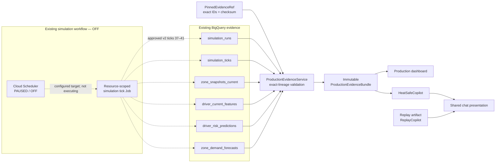

# Unified Sidebar and Hackathon Simulation Evidence Implementation Plan

**Date**: 29-07-26
**Complexity**: COMPLEX — standard, one execution stream
**Status**: 🧪 TESTING — code, cloud bundle, deployment, and automated gates complete; visual confirmation pending
**Selected plan**: `process/general-plans/active/unified-sidebar-production-cloud-evidence_29-07-26/unified-sidebar-production-cloud-evidence_PLAN_29-07-26.md`
**Research transcript**: `process/UI-isolation-Production-cloud-evidence/Unified Sidebar Production Event Replay.md`
**Execution boundary**: the user approved materializing one new five-tick bundle and deploying it.
Cloud Scheduler is required in the workflow at 15-minute cadence and must remain `PAUSED`/OFF.
Authentication is explicitly out of scope and was not changed.

> **TL;DR:** Use the reviewed local Event Replay v2 state to materialize a new cloud bundle for
> ticks 37–41 on the ACTIVATE branch. Every tick is published in BigQuery and scored by the
> existing BQML model and TimesFM 2.5; no model retraining is needed. Production pins tick 41 by
> exact run/dataset lineage and fails closed if the five-tick ledger is incomplete. Event Replay
> remains artifact-bound and independent. A new 15-minute Scheduler is part of the topology but
> stays `PAUSED`/OFF. Keep the visible label `Live conditions`.

## Quick Links

- [1. Context and Goals](#1-context-and-goals)
- [2. Current Source of Truth](#2-current-source-of-truth)
- [3. Scope](#3-scope)
- [4. Phase Completion Rules](#4-phase-completion-rules)
- [5. Execution Brief](#5-execution-brief)
- [6. Architecture Decisions](#6-architecture-decisions)
- [7. Target Architecture and Data Flow](#7-target-architecture-and-data-flow)
- [Public Contracts](#public-contracts)
- [9. Phased Execution Workflow](#9-phased-execution-workflow)
- [10. Delivery Phases](#10-delivery-phases)
- [11. Acceptance Criteria](#11-acceptance-criteria)
- [12. Implementation Checklist](#12-implementation-checklist)
- [Touchpoints](#touchpoints)
- [Blast Radius](#blast-radius)
- [Verification Evidence](#verification-evidence)
- [16. Risks and Mitigations](#16-risks-and-mitigations)
- [17. Research References](#17-research-references)
- [18. Resume and Execution Handoff](#18-resume-and-execution-handoff)
- [Test Infra Improvement Notes](#test-infra-improvement-notes)
- [Validate Contract](#validate-contract)

## 1. Context and Goals

### Review verdict

The supplied transcript contains the correct product boundary but is not directly executable. It
is a long research export with superseded proposals, an irrelevant authentication branch, and
assumptions that predate the current shared chat shell and the completed BigQuery scoring work.

The corrected implementation direction is:

1. Share only the Copilot presentation shell.
2. Keep Production and Event Replay engines, prompts, tools, histories, and evidence independent.
3. Remove operator-editable cost controls while retaining fixed server-side policy guardrails.
4. Replace local `ProductionSession` evidence with one exact BigQuery simulation bundle.
5. Materialize exactly ticks 37–41 from the current reviewed local Event Replay v2 ACTIVATE path.
6. Reuse the deployed BQML and TimesFM models; no retraining is needed.
7. Keep the new 15-minute simulation Scheduler visible in the workflow but `PAUSED`/OFF.
8. State clearly that this is hackathon simulation evidence, not real fleet telemetry.

### Goals

- Make the Production workspace demonstrate genuine cloud-backed model evidence without claiming
  real operational telemetry.
- Ensure the Production dashboard and Production Copilot cannot read different runs or ticks.
- Preserve deterministic Event Replay behavior and its no-cloud dependency.
- Keep the UI clean by removing editable cost fields from the sidebar.
- Fail closed when the pinned evidence is missing, incomplete, or no longer coherent.
- Complete the hackathon slice without unnecessary data regeneration, model retraining, or new
  provider resources.

### Success metrics

- One pinned dataset + `simulation_run_id` + tick index identifies all Production evidence.
- The bundle ledger contains exactly five `SUCCEEDED`/`SCORED` ticks, 37–41.
- Selected tick 41 contains 10 zones, 25,146 BQML prediction rows, and 160 TimesFM forecast rows.
- All component queries use the same exact lineage; none select an independent “latest”.
- Production and Event Replay chat state remain isolated under separate keys.
- All relevant automated tests pass and a hard-refresh runtime screenshot/manual check confirms
  the visible disclosure and no clipped sidebar content.
- Read-only cloud verification shows the selected simulation run remains `PAUSED`, its selected
  tick remains `SUCCEEDED`/`SCORED`, and all Cloud Schedulers remain `PAUSED`.

## 2. Current Source of Truth

### 2.1 Repository and history

- Active checkout: `/Users/tuanle/CODE/my-project/heatsafe-hackathon`
- Branch reviewed: `main`
- Relevant implementation history:
  - `bdab8ab Improve replay copilot and operator UI`
  - `297e479 feat(safepause): implement +15m rolling policy for Event Replay`
  - `98b21dc feat(ui): refine Streamlit operator console`
  - `118dce7 feat(ui): add smooth operator console playback`
  - `9a8774e feat: AI wave optimization with BigQuery ML counterfactual scoring`
- `_render_chat()` already supplies a shared presentation shell.
- `HeatSafeCopilot` and `ReplayCopilot` are already separate backend engines.
- `BigQueryRepository` already reads materialized forecasts, features, predictions, and model
  evaluation data.
- `infra/ml_pipeline.py` already contains TimesFM `AI.FORECAST`, `ML.PREDICT`, and
  `ML.EXPLAIN_PREDICT` paths.
- The current Production window later moved back to local `ProductionSession` evidence, so the
  remaining work is reconnection and isolation, not a cloud pipeline rebuild.
- Canonical repository context paths `process/context/all-context.md` and
  `process/context/tests/all-tests.md` were checked and are not present in this repository; source,
  tests, history, and the supplied transcript are therefore the current research inputs.

### 2.2 Verified selected hackathon evidence

The approved Cloud Run orchestration execution
`heatsafe-event-replay-bundle-20260729141436-kdglf` completed successfully on 29/07. It reused
the reviewed local v2 warm state, materialized ACTIVATE controls at tick 40, scored tick 41, and
paused the run:

| Lineage field | Pinned value |
|---|---|
| `dataset_id` | `heatsafe_event_replay_v2_20260729` |
| `scenario_id` | `heatwave` |
| `scenario_version` | `hanoi_heatwave_v1` |
| `simulation_run_id` | `8cf771e3c7d846128224504fa554885b` |
| selected `tick_id` | `ed39961b6120b7e9dd92f607ea9974bd` |
| selected `tick_index` | `41` |
| selected `snapshot_id` | `2018f7df247f3248393254c3c5e4026c` |
| `run_status` | `PAUSED` |
| ticks 37–41 | all `SUCCEEDED` / `SCORED` |
| `pending_score_tick_id` | `NULL` |
| `risk_model_version` | `heat-risk-bqml-20260705T103527Z` |
| `forecast_context_version` | `timesfm-2.5-context-2048-v1` |
| `forecast_context_point_count` | `20,160` |
| `generator_version` | `stateful-replay-v2` |
| selected branch | `ACTIVATE` |

Component evidence for the five ticks:

| Tick | Status | BQML prediction rows | TimesFM forecast rows |
|---:|---|---:|---:|
| 37 | `SUCCEEDED` / `SCORED` | 27,333 | 160 |
| 38 | `SUCCEEDED` / `SCORED` | 26,631 | 150 |
| 39 | `SUCCEEDED` / `SCORED` | 25,920 | 140 |
| 40 | `SUCCEEDED` / `SCORED` | 25,245 | 130 |
| 41 | `SUCCEEDED` / `SCORED` | 25,146 | 160 |

Tick 41 applied 10 ACTIVATE control events covering 43 selected drivers. All five ticks record
`MODEL_INPUT_OOD`: the v2 values exceeded the older model envelope, so the existing scoring
pipeline clipped them before real BQML scoring. This is retained as visible evidence rather than
hidden. The generic OOD control guard remains unchanged; only the reviewed local ACTIVATE artifact
was imported by the bounded bundle orchestrator.

### 2.3 Scheduler source of truth

Read-back verification on 29/07 confirmed the newly provisioned workflow:

| Scheduler | Cadence | Target | State |
|---|---|---|---|
| `heatsafe-simulation-real-ops-15m-20260729141436` | `*/15 * * * *` | `heatsafe-simulation-tick-20260729141436` | `PAUSED` |

Legacy Schedulers were not modified. The manual one-shot bundle orchestrator is separate from the
recurring Scheduler and left the run paused.

### 2.4 Why no regeneration or retraining

- The new v2 run contains the fields required by current simulation and UI contracts.
- All five ticks were scored with the deployed BQML risk model and TimesFM 2.5.
- Selected tick 41 has ten coherent zones under exact lineage.
- A new training run would add time, provider cost, and reproducibility risk without fixing a
  demonstrated evidence gap.
- This is a hackathon demo; the UI keeps `Live conditions` as the workspace label while its
  evidence disclosure identifies the source as simulated fleet operations.

## 3. Scope

### In scope

- Pin the verified simulation lineage in validated server configuration.
- Add a read-only `ProductionEvidenceBundle` loader using exact BigQuery predicates.
- Validate run, tick, component counts, zone coverage, and cross-component lineage before use.
- Load one bundle once per Streamlit render and pass it to both the Production dashboard and
  Production Copilot adapter.
- Preserve one shared chat presentation component with separate Production/Event Replay state.
- Pass bounded Production-only message history to `HeatSafeCopilot`.
- Keep Event Replay bound to its immutable replay frame and existing replay tools.
- Remove sidebar cost input controls and their apply handler.
- Retain fixed policy values in server settings and expose them only as read-only context where
  useful.
- Show prominent `Hackathon simulation` / `Simulated fleet operations` disclosure.
- Keep the existing simulation Scheduler workflow documented and verify it remains `PAUSED`/OFF.
- Add deterministic unit, repository, AppTest, isolation, and manual runtime checks.

### Out of scope

- Authentication, IAP, login, user identity, role management, or access-control work.
- Real-time weather/fleet ingestion for this slice.
- Further simulation runs, scoring runs, data reseeding, or model retraining after the approved
  five-tick bundle.
- New BigQuery publication/manifest tables.
- Executing the recurring Scheduler target after bundle materialization.
- Resuming or enabling any Cloud Scheduler.
- Real driver dispatch, payroll, notifications, or driver-facing integrations.
- React/FastAPI migration.
- Persistent multi-user chat storage.
- Combining Production and Event Replay engines or evidence.
- Changing Event Replay timeline, +15-minute rolling policy, or branch semantics.

### Assumptions and constraints

- The app is a public hackathon demonstration.
- BigQuery remains the source of model evidence for Production mode.
- Session-local chat history is sufficient.
- The selected “current” feature and snapshot rows remain stable because the simulation workflow
  is OFF.
- If those mutable current tables are later overwritten, the exact-lineage query returns an
  incomplete bundle and the UI fails closed; it must never silently fall forward to another run.
- Provider writes require separate approval after local gates pass.
- The app must not describe simulated fleet operations as observed production telemetry.

## 4. Phase Completion Rules

A phase is NOT complete until:

1. **Integration Test** - Works with other system pieces
2. **Manual Test** - User can perform the action
3. **Data Verification** - Database/state changes confirmed
4. **Error Handling** - Failure cases handled gracefully
5. **User Confirmation** - User says "it works"

Status meanings:

- ⏳ PLANNED - Not started
- 🔨 CODE DONE - Written but not E2E tested
- 🧪 TESTING - Currently being tested
- ✅ VERIFIED - Tested AND confirmed working
- 🚧 BLOCKED - Has issues

After each phase, document:

- [ ] What was tested manually
- [ ] Data verified in DB (show query + result)
- [ ] Errors encountered and fixed
- [ ] User confirmation received

## 5. Execution Brief

### Phase group 1 — UI and state isolation

**What happens:** Remove cost inputs, create explicit per-mode chat namespaces, and retain the
shared presentation shell while keeping the two adapters independent.

**Integration points:** `app.py` → `heatsafe/ui/copilot_panel.py` → separate Copilot classes.

**Test:** Run focused unit/AppTest suites; switch repeatedly between modes; clear one chat; verify
the other chat and evidence stay unchanged.

**Verify:** Inspect `st.session_state` keys and assert Event Replay makes zero BigQuery calls.

**Done when:** The user confirms the two panels look consistent and remain behaviorally isolated.

### Phase group 2 — Certify and load pinned simulation evidence

**What happens:** Encode the selected lineage, load the four BigQuery components, and validate the
existing `simulation_runs`/`simulation_ticks` publication state.

**Integration points:** settings → repository → `ProductionEvidenceService` → immutable bundle.

**Test:** Use fake BigQuery rows for complete, missing, mixed-lineage, wrong-count, and overwritten
current-table cases.

**Verify:** Run the read-only completeness query for the pinned IDs and compare counts/checksum to
Section 2.2.

**Done when:** One loader call either returns the exact complete bundle or a typed unavailable
result; it never mixes/falls forward.

### Phase group 3 — Reconnect Production workspace

**What happens:** Replace local `ProductionSession` evidence in Production mode with the immutable
bundle and pass the same instance to dashboard and Copilot.

**Integration points:** evidence service → map/charts/metrics → Production Copilot facts/tools.

**Test:** AppTest complete/unavailable states and identity assertions for dashboard/Copilot
lineage.

**Verify:** Visible labels show pinned simulation time, model/generator lineage, and simulation
disclosure.

**Done when:** The user confirms Production works from the pinned BigQuery/BQML/TimesFM evidence
and Event Replay is unchanged.

### Phase group 4 — Runtime and cloud proof

**What happens:** Validate the local/approved deployed app and perform BigQuery, Cloud Run, and
Scheduler checks. The approved one-shot materialization is complete; recurring execution remains
disabled.

**Integration points:** Streamlit Cloud Run service → BigQuery read path; Scheduler → simulation
tick Job remains OFF.

**Test:** Hard-refresh the app, inspect both modes, submit bounded prompts, and capture screenshots.

**Verify:** Selected tick is still `SUCCEEDED`/`SCORED`, run is `PAUSED`, counts still match, and
every Scheduler remains `PAUSED`.

**Done when:** The user accepts the runtime evidence.

### Expected Outcome

- Production is cloud-backed by one explicitly pinned simulation tick.
- Dashboard and Production Copilot cannot disagree on lineage.
- Event Replay remains deterministic and independent.
- No model or data regeneration is required.
- Scheduler remains present, auditable, and OFF.
- Authentication remains untouched.

## 6. Architecture Decisions

### AD-001 — Share presentation, not AI state

`_render_chat()` remains a presentation-only primitive. Production and Event Replay keep separate:

- state namespaces;
- history;
- adapter functions;
- Copilot classes;
- prompts and tool registries;
- evidence objects;
- unavailable/error behavior.

### AD-002 — Pin exact hackathon evidence

Do not query “latest”. The selected lineage is a versioned server configuration contract. Every
component query must include the applicable exact values from Section 2.2.

This avoids a new BigQuery manifest table while using existing `simulation_runs` and
`simulation_ticks` as the publication record.

### AD-003 — Existing run/tick state is the readiness gate

A bundle is usable only when:

- `simulation_runs.status = 'PAUSED'`;
- `simulation_ticks.status = 'SUCCEEDED'`;
- `simulation_ticks.scoring_outcome = 'SCORED'`;
- `pending_score_tick_id IS NULL`;
- tick/run publication indices cover the pinned tick;
- tick snapshot and forecast source lineage match the pin;
- tick output checksum matches the configured checksum;
- all four component gates pass.

No new `READY` table is required.

### AD-004 — Exact-lineage, fail-closed reads

The loader never substitutes another tick, snapshot, prediction run, or scenario. If exact rows
are absent or invalid:

- show monitoring/evidence unavailable;
- disable recommendations/actions derived from the bundle;
- keep Event Replay available;
- include a deterministic reason code;
- do not ask Gemini to reinterpret the failure.

### AD-005 — Reuse models; no retraining

The selected bundle references:

- BQML risk model `heat-risk-bqml-20260705T103527Z`;
- TimesFM context `timesfm-2.5-context-2048-v1`;
- simulation generator `stateful-replay-v2`.

The request path is read-only. TimesFM/BQML/optimizer are never invoked by a chat request.

### AD-006 — Scheduler remains part of workflow but OFF

The architectural workflow remains:

`Cloud Scheduler → resource-scoped simulation tick Cloud Run Job → existing BigQuery simulation tables`

For this hackathon slice:

- preserve the resource-scoped Scheduler and target relationship;
- require `state=PAUSED` before and after all provider verification;
- never call `resume`;
- do not execute the recurring target Job after the approved manual materialization;
- stop provider work if any relevant Scheduler is unexpectedly `ENABLED`.

### AD-007 — Fixed policy, no sidebar editing

Cost and safety policy values remain validated server-side settings. The sidebar does not expose
editable budget/support fields or an apply button. Removing controls must not remove the optimizer
constraints.

### AD-008 — Honest Production labeling

`PRODUCTION` is a workspace mode name, not a claim that the selected evidence is current real
fleet telemetry. The UI must show:

- `Hackathon simulation`;
- simulated fleet operations;
- pinned simulation time;
- source/model lineage;
- no real dispatch.

## 7. Target Architecture and Data Flow



### Production render sequence

1. Build and validate `PinnedEvidenceRef`.
2. Read the exact run and tick control rows.
3. Reject anything outside the readiness gate.
4. Query all four data components with exact lineage predicates.
5. Validate counts, ten-zone coverage, forecast horizon, action variants, and required fields.
6. Construct one immutable `ProductionEvidenceBundle`.
7. Pass that same instance to dashboard rendering and the Production Copilot adapter.
8. Render deterministic unavailable state instead of partial data on any failure.

## Public Contracts

### `PinnedEvidenceRef`

```python
@dataclass(frozen=True)
class PinnedEvidenceRef:
    scenario_id: str
    simulation_run_id: str
    tick_id: str
    tick_index: int
    snapshot_id: str
    prediction_run_id: str
    output_checksum: str
```

Values are server configuration, not sidebar inputs.

### `ProductionEvidenceLineage`

```python
@dataclass(frozen=True)
class ProductionEvidenceLineage:
    scenario_id: str
    scenario_version: str
    simulation_run_id: str
    tick_id: str
    tick_index: int
    snapshot_id: str
    prediction_run_id: str
    simulation_time: datetime
    finished_at: datetime
    risk_model_version: str
    forecast_context_version: str
    generator_version: str
    output_checksum: str
```

### `ProductionEvidenceBundle`

```python
@dataclass(frozen=True)
class ProductionEvidenceBundle:
    lineage: ProductionEvidenceLineage
    zones: tuple[ZoneSnapshot, ...]
    driver_features: tuple[DriverFeatures, ...]
    predictions: tuple[RiskPrediction, ...]
    forecasts: tuple[DemandForecast, ...]
    disclosure: str
```

The bundle must be immutable at the application boundary. Components cannot be independently
refreshed during one render.

### Typed unavailable result

Expected reason codes:

- `PIN_INVALID`
- `RUN_NOT_PAUSED`
- `TICK_NOT_READY`
- `CHECKSUM_MISMATCH`
- `LINEAGE_MISMATCH`
- `ZONE_COVERAGE_INCOMPLETE`
- `FEATURES_INCOMPLETE`
- `PREDICTIONS_INCOMPLETE`
- `FORECASTS_INCOMPLETE`
- `SOURCE_OVERWRITTEN`
- `BIGQUERY_UNAVAILABLE`

### Chat namespaces

Use explicit keys such as:

- `production_copilot_messages`
- `production_copilot_pending_prompt`
- `replay_copilot_messages`
- `replay_copilot_pending_prompt`

Clearing or switching one mode must not mutate the other namespace.

## 9. Phased Execution Workflow

This plan uses a phase-by-phase execution model with built-in verification gates.

For each phase:

1. **Pre-Phase Research** — inspect the current exact files and drift since this plan; present
   findings and stop for approval.
2. **Detailed Planning** — confirm exact edits, tests, and success criteria.
3. **Implementation** — execute only the approved phase.
4. **Testing & Verification** — run automated, integration, data, and manual checks.
5. **User Confirmation** — report:
   - **What's Functional Now**
   - **What Was Tested**
   - **What You Can Test**
   - **Ready For**

Do not bundle all phases into one implementation call. After each phase, stop and verify before
proceeding.

## 10. Delivery Phases

### Phase 0 — Research and evidence certification

**Status:** ✅ VERIFIED and superseded by the approved v2 materialization.

Completed:

- reviewed the transcript, repository history, current app/Copilot/repository/ML code;
- confirmed prior BigQuery ML and scoring work exists;
- confirmed the older 24–26/07 v1 evidence did not match the current v2 source closely enough;
- selected local Event Replay v2 ticks 37–41, ACTIVATE, as the new source;
- verified the local artifact checksum, seed 42, warm state, and branch coverage;
- verified current Scheduler state was `PAUSED`.

### Phase 1 — Isolate chat state and remove sidebar cost controls

**Status:** ✅ VERIFIED by focused UI/state regression tests.

Implementation:

- inventory the current shared renderer and mode adapters;
- introduce explicit per-mode state namespaces;
- pass bounded Production-only history to `HeatSafeCopilot`;
- preserve replay history isolation and frame-bound evidence;
- remove cost input widgets and their apply handler;
- move/retain fixed policy values in validated server settings;
- add read-only policy disclosure only where it helps the operator.

Tests:

- Production clear does not clear Replay;
- Replay clear does not clear Production;
- switching mode does not leak pending prompts;
- replay remains zero-cloud-call;
- cost widgets and apply event no longer exist;
- fixed policy constraints still reach the optimizer/Copilot facts.

**Done criteria:** focused tests pass and the user confirms the sidebar/chat behavior.

### Phase 2 — Implement pinned BigQuery simulation bundle

**Status:** ✅ VERIFIED.

Implementation:

- added validated dataset/run/tick settings using Section 2.2 values;
- added fail-closed `CloudProductionBundle` verification and exact replay-tick loading;
- enforced five scored ticks, paused run, null pending score, selected tick readiness, v2
  generator, BQML model lineage, and TimesFM context lineage;
- materialized the new isolated dataset and exact five-tick run without retraining.

Tests:

- complete bundle;
- run not paused;
- tick not succeeded/scored;
- pending score;
- checksum mismatch;
- mixed tick/snapshot/prediction rows;
- missing zone;
- missing required new driver fields;
- wrong action-variant count;
- missing forecasts;
- overwritten current tables;
- BigQuery exception.

**Done criteria:** deterministic tests prove exact-lineage loading and fail-closed behavior.

### Phase 3 — Reconnect Production UI and Copilot

**Status:** ✅ VERIFIED by automated and cloud-read smoke tests.

Implementation:

- replace Production `ProductionSession` evidence construction with one service call;
- pass one bundle instance to all Production metrics/maps/charts;
- build Copilot evidence/tools from that same bundle;
- show pinned simulation time and source lineage;
- show clear hackathon simulation/no-real-dispatch disclosure;
- disable recommendation actions in unavailable state;
- leave Event Replay code path and artifact source unchanged.

Tests:

- complete bundle AppTest;
- unavailable bundle AppTest;
- dashboard and Copilot share identical lineage object/value;
- Gemini is not called for deterministic unavailable output;
- labels never imply observed real fleet telemetry;
- Event Replay regression suite remains green.

**Done criteria:** app integration tests pass and the user confirms both modes visually.

### Phase 4 — Integrated local runtime verification

**Status:** 🧪 TESTING — automated gates pass; hard-refresh visual confirmation pending.

Implementation/verification:

- run the focused unit/repository/AppTest suite;
- run the broader relevant regression suite;
- start Streamlit locally using the intended cloud-read configuration;
- hard-refresh and manually test both modes;
- capture screenshots supplied/approved by the user;
- inspect readable typography, map/chart behavior, and overflow;
- verify no chat prompt invokes training, scoring, or simulation.

**Done criteria:** automated gates are green and the user accepts the hard-refresh screenshots.

### Phase 5 — Approved deploy and cloud proof

**Status:** ✅ VERIFIED except the user visual gate.

Completed:

- built immutable image digest
  `sha256:4337c445809896723b0904318e18098e39b70bb9665fb8bf2c2862146817cea8`;
- provisioned the isolated datasets, Cloud Run Jobs, and 15-minute Scheduler;
- executed the approved manual orchestrator and verified ticks 37–41;
- confirmed the run and Scheduler are both paused;
- deployed the cloud-backed app through `heatsafe-ops-00011-9s2` at 100% traffic;
- reduced measured Production cold-load from 19.45s to 13.43s and verified a
  12ms hot-cache workspace render on the single warm instance;
- confirmed service health and smoke-tested the exact Production bundle/plan/decision paths.

**Done criteria:** deployed runtime proof is accepted by the user and Scheduler remains OFF.

## 11. Acceptance Criteria

- **AC-01:** Production and Event Replay use one visual chat shell.
- **AC-02:** Their histories, pending prompts, clear actions, adapters, tools, prompts, and evidence
  remain isolated.
- **AC-03:** Event Replay remains artifact-bound and makes no BigQuery call.
- **AC-04:** Sidebar budget/support inputs and their apply action are absent.
- **AC-05:** Fixed policy guardrails remain validated server-side.
- **AC-06:** Production loads only the pinned dataset/run/tick in Section 2.2.
- **AC-07:** Run is `PAUSED`, all ticks 37–41 are `SUCCEEDED`/`SCORED`, and pending score is null
  before bundle construction.
- **AC-08:** Selected tick 41 contains 10 zones, 25,146 BQML prediction rows, and 160 TimesFM
  forecast rows.
- **AC-09:** Dashboard and Production Copilot consume the same immutable bundle/lineage.
- **AC-10:** Missing, partial, mixed, or overwritten evidence fails closed and does not fall
  forward to another run.
- **AC-11:** Production UI visibly discloses hackathon simulation, pinned simulation time, and no
  real dispatch.
- **AC-12:** No chat request invokes TimesFM, BQML training/scoring, ingestion, or simulation.
- **AC-13:** No model retraining is required; the approved five-tick materialization is complete.
- **AC-14:** The new 15-minute Scheduler → tick Job workflow is documented and the Scheduler
  remains `PAUSED`/OFF.
- **AC-15:** Authentication behavior is unchanged.
- **AC-16:** Focused automated tests, integration tests, read-only data checks, and user visual
  confirmation pass.

## 12. Implementation Checklist

### Phase 1

- [ ] Recheck current chat renderer/adapters and session-state drift.
- [ ] Add explicit Production and Replay chat namespaces.
- [ ] Add isolation tests before changing callers.
- [ ] Pass bounded Production-only history to `HeatSafeCopilot`.
- [ ] Remove cost widgets/apply handler.
- [ ] Preserve validated fixed policy settings and test optimizer inputs.
- [ ] Run focused app/Copilot/replay tests.
- [ ] Present manual switch/clear steps and stop for user confirmation.

### Phase 2

- [x] Add validated dataset/run/tick settings.
- [x] Add exact-lineage repository loading and tests.
- [x] Add five-tick run/readiness validation tests.
- [x] Implement fail-closed `CloudProductionBundle`.
- [x] Add component and cross-lineage checks.
- [x] Run repository/evidence test suite.
- [x] Verify source/count/model evidence in BigQuery.

### Phase 3

- [x] Replace local Production evidence construction with one bundle load.
- [x] Pass the same repository/bundle lineage to dashboard and Production Copilot.
- [x] Preserve `Live conditions` and fail closed when the bundle is unavailable.
- [x] Add complete/unavailable tests.
- [x] Run Event Replay regression tests.
- [ ] Obtain hard-refresh visual confirmation.

### Phase 4

- [ ] Run focused and relevant regression suites.
- [ ] Launch local Streamlit against the cloud-read configuration.
- [ ] Manually verify both modes after hard refresh.
- [ ] Verify typography, maps/charts, sidebar overflow, and disclosures.
- [ ] Verify prompt path performs no training/scoring/simulation execution.
- [ ] Collect user screenshots and confirmation.

### Phase 5

- [x] Obtain explicit approval before provider work.
- [x] Create the 15-minute Scheduler and leave it `PAUSED`.
- [x] Execute only the approved manual five-tick orchestrator.
- [x] Re-run read-only pinned evidence queries.
- [x] Read back Scheduler target/cadence/state.
- [x] Deploy revision `heatsafe-ops-00011-9s2` with 2 CPU, 1 GiB,
  `minScale=1`, and `maxScale=1`.
- [x] Verify health and Production bundle smoke paths.
- [ ] Obtain user visual confirmation.

## Touchpoints

Expected files; exact list must be refreshed in each pre-phase research step.

| File / area | Intended change |
|---|---|
| `app.py` | Per-mode state, Production bundle load, sidebar cleanup, disclosure |
| `heatsafe/config.py` | Validated pinned lineage and fixed policy settings |
| `heatsafe/repository.py` | Exact-lineage BigQuery reads |
| `heatsafe/production_evidence.py` | New immutable bundle service/contracts |
| `heatsafe/copilot.py` | Consume bounded bundle facts/history without triggering ML |
| `heatsafe/ui/copilot_panel.py` | Presentation-only namespace parameters if needed |
| `tests/test_app.py` | Sidebar, state, complete/unavailable Production AppTest |
| `tests/test_repository.py` | Exact query predicates and row mapping |
| `tests/test_production_evidence.py` | Readiness/completeness/fail-closed contract |
| `tests/test_replay_copilot.py` | Isolation and replay regression |
| `scripts/deploy_gcp.sh` | Only if needed for pinned read config; no Scheduler activation |
| `scripts/deploy_simulation_gcp.sh` | No functional change expected; static OFF contract proof |
| `README.md` / demo docs | Simulation evidence and Scheduler OFF disclosure |

Explicitly untouched unless a newly discovered blocker requires plan revision:

- authentication/IAP code and flags;
- BigQuery schema/provisioning;
- ML training/scoring implementation;
- simulation generator/tick implementation;
- Replay artifact and replay policy logic;
- React frontend branch.

## Blast Radius

| Area | Risk | Containment |
|---|---|---|
| Streamlit session state | Cross-mode history leakage | Namespaced keys + switch/clear tests |
| Production data source | Partial/mixed evidence | Exact pin + immutable bundle + fail closed |
| Current BigQuery tables | Later simulation overwrite | Scheduler OFF + exact predicates + source-overwritten state |
| Production Copilot | Claims unsupported by evidence | Bundle-bounded facts/tools + disclosure |
| Event Replay | Regression from shared shell changes | Artifact/no-cloud tests every UI phase |
| Policy constraints | UI removal accidentally drops guardrails | Server settings + optimizer input tests |
| Model/provider cost | Accidental execution | Read-only request path; no Jobs in plan |
| Scheduler | Accidental recurring work | Pre/post read-back; `PAUSED` invariant; no resume |
| Public demo framing | Simulation presented as telemetry | Persistent hackathon simulation labels |
| Authentication | Unwanted scope expansion | Explicit non-goal; no auth touchpoints |

## Verification Evidence

| Gate / Scenario | Strategy | Proves SPEC criterion |
|---|---|---|
| Chat clear/switch isolation | Fully automated AppTest/unit | AC-01, AC-02 |
| Replay makes zero BigQuery calls | Fully automated fake/spy | AC-03 |
| Cost controls absent | Fully automated AppTest/static | AC-04 |
| Fixed policy reaches optimizer | Fully automated unit | AC-05 |
| Exact pin in every query | Fully automated query-shape tests | AC-06, AC-10 |
| Run/tick readiness | Fully automated fakes + hybrid provider read | AC-07 |
| Component counts and fields | Fully automated fakes + hybrid BigQuery read | AC-08 |
| Same bundle for dashboard/Copilot | Fully automated identity/lineage assertion | AC-09 |
| Partial/mixed/overwritten source | Fully automated failure matrix | AC-10 |
| Simulation/no-dispatch disclosure | AppTest + manual screenshot | AC-11 |
| No ML/Job call on prompt | Fully automated spies + runtime log review | AC-12 |
| No provider regeneration | Git/static review + cloud job history read | AC-13 |
| Scheduler target and PAUSED state | Hybrid read-only cloud verification | AC-14 |
| Authentication unchanged | Git diff/static review | AC-15 |
| End-to-end Production/Replay flow | AppTest + hard-refresh manual check | AC-16 |

## 16. Risks and Mitigations

| Risk | Impact | Mitigation |
|---|---|---|
| `zone_snapshots_current` or `driver_current_features` is overwritten | Pinned bundle disappears | Keep Scheduler OFF; exact IDs; show `SOURCE_OVERWRITTEN` |
| Zone row generator is null | Misread lineage | Use authoritative tick generator; test/document exception |
| Historical model is described as current | Misleading demo | Show model version and simulation timestamp |
| Independent latest queries mix runs | Contradictory dashboard/Copilot | Ban latest selection; exact predicates only |
| Incomplete evidence still reaches Gemini | Unsupported recommendation | Validate before Copilot; deterministic unavailable response |
| Removing controls removes constraints | Unsafe optimizer output | Keep fixed validated policy and tests |
| Scheduler is accidentally enabled | Unexpected cost and data drift | Read state first; stop if enabled; never resume |
| Deployment broadens into data work | Time/cost risk | UI-only deploy boundary and separate approval |
| Replay changes accidentally | Demo regression | Replay regression and no-cloud contract |

## 17. Research References

Official references supporting the retained architecture:

- [Streamlit Session State](https://docs.streamlit.io/develop/api-reference/caching-and-state/st.session_state)
- [BigQuery query parameterization](https://cloud.google.com/bigquery/docs/parameterized-queries)
- [BigQuery query computation best practices](https://cloud.google.com/bigquery/docs/best-practices-performance-compute)
- [BigQuery AI.FORECAST / TimesFM](https://cloud.google.com/bigquery/docs/reference/standard-sql/bigqueryml-syntax-ai-forecast)
- [Cloud Run Jobs overview](https://cloud.google.com/run/docs/overview/what-is-cloud-run)
- [Execute Cloud Run Jobs on a schedule](https://cloud.google.com/run/docs/execute/jobs-on-schedule)
- [Pause Cloud Scheduler jobs](https://cloud.google.com/scheduler/docs/creating#pause_a_job)

Research implications:

- Parameterized exact-lineage reads are safer than string-built or independent latest queries.
- Materialized model outputs keep chat latency/cost bounded.
- A paused Scheduler preserves demonstrable workflow topology without recurring execution.
- The already-scored simulation data satisfies the hackathon requirement; model retraining is not
  an implementation dependency.

## 18. Resume and Execution Handoff

1. **Selected plan file**
   `process/general-plans/active/unified-sidebar-production-cloud-evidence_29-07-26/unified-sidebar-production-cloud-evidence_PLAN_29-07-26.md`

2. **Last completed phase**
   Phases 0–3 and provider execution/deploy are complete. Phase 4 awaits user hard-refresh visual
   confirmation.

3. **Pinned evidence**
   Dataset `heatsafe_event_replay_v2_20260729`, run
   `8cf771e3c7d846128224504fa554885b`, tick 41
   `ed39961b6120b7e9dd92f607ea9974bd`, snapshot
   `2018f7df247f3248393254c3c5e4026c`.

4. **Validate-contract status**
   Run the installed plan validator after every plan change. The placeholder below remains for the
   later ADAS validation workflow before EXECUTE.

5. **Next executor action**
   Capture the final manual screenshot evidence for revision
   `heatsafe-ops-00011-9s2` if the submission packet requires it; Production
   runtime and Continue-monitoring telemetry have already been verified.

### Cursor + RIPER-5 guidance

- Use the phase checklist as the execution source.
- RESEARCH → detailed PLAN → approved EXECUTE → VERIFY → user confirmation.
- Do not execute all phases in one batch.
- If scope expands into authentication, Scheduler activation, provider data generation, model
  retraining, real dispatch, or React migration, pause and revise this plan.

**Next instruction:** complete the hard-refresh visual gate; do not enable the Scheduler.

## Test Infra Improvement Notes

(none identified yet)

## Validate Contract

(placeholder — adas-validate-agent writes this section before EXECUTE)
